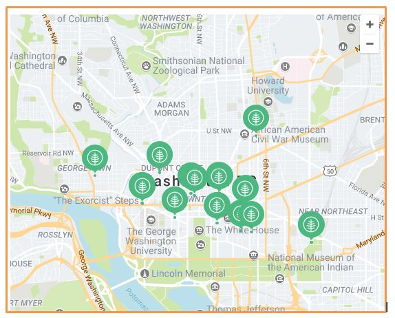

# Reto-Navegación

## Objetivo
Identificar los elemento de navegación del site Breather,Github y Medium.

### Site Breather
* **Navegación global**

  Navegación principal y se repite en cada opción de la web.

  

  

* **Navegación faceteada**

  Brinda un filtro predeterminado sobre el tipo de espacio de trabajo.

  

  Brinda un filtro predeterminado según el lugar.

  

* **Navegación filtrada**

 Brinda resultados eligiendo el lugar, dia y cantidad de personas.

 

 Permite realizar una búsqueda según el día, hora y tiempo de duración.

 

* **Navegación contextual**

 Indica recomendaciones sobre espacios de trabajo

### Site Github
